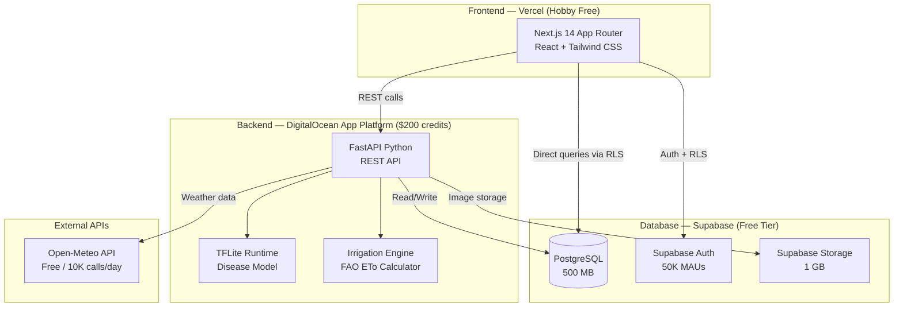
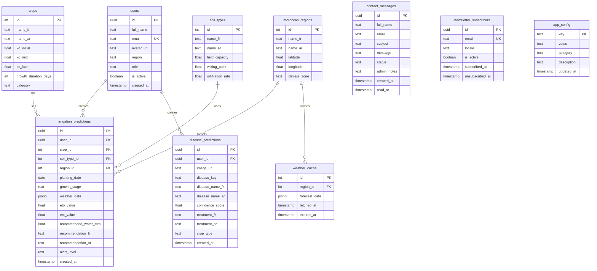

# Smart Irrigation & Crop Disease Detection System

Full implementation plan — **free tiers + DigitalOcean $200 credits**.

---

## 1. Architecture Overview



---

## 2. Hosting & Cost Breakdown

| Service | Plan & Limits | Monthly Cost | Strategy |
|:---|:---|:---|:---|
| **Vercel** | Hobby — 100 GB bandwidth, 1M invocations, 100 deploys/day | **$0** | SSG/ISR for static pages. API routes minimal — heavy logic on DO. |
| **DigitalOcean App Platform** | Basic — 1 GB RAM, 1 vCPU, always-on, auto-deploy from GitHub | **~$6/mo** | Hosts FastAPI + TFLite model. No cold starts. **$200 credits ≈ 33 months runway.** |
| **Supabase** | Free — 500 MB DB, 1 GB storage, 50K MAUs | **$0** | Lean schema. Compressed images. Cron ping to prevent pausing. |
| **Open-Meteo** | Free — 10,000 calls/day, no API key | **$0** | Cache responses in Supabase (TTL: 1 hour). |
| | | **Total: ~$6/mo** | |

> [!TIP]
> **No cold starts!** Unlike Render's free tier, DigitalOcean App Platform keeps your service running 24/7. The API will respond instantly to every request.

> [!IMPORTANT]
> **Supabase project pausing**: The free project pauses after 7 days of no DB activity. A simple scheduled ping (e.g., via GitHub Actions cron or UptimeRobot) will prevent this.

> [!NOTE]
> **Budget runway**: At ~$6/month, your $200 DigitalOcean credits will last approximately **33 months** (~2.7 years). If you add a managed DB later ($7/mo), you'd still get ~15 months.

---

## 3. Technology Stack (Confirmed)

### Frontend
| Technology | Purpose |
|:---|:---|
| **Next.js 14** (App Router) | Framework, SSR/SSG, routing |
| **React 18** | UI components |
| **Tailwind CSS v3** | Styling (as specified in cahier des charges) |
| **next-intl** | Internationalization (French + Arabic with RTL) |
| **Recharts** | Dashboard charts & weather graphs |
| **@supabase/ssr** | Auth integration (cookie-based JWT) |

### Backend (DigitalOcean App Platform)
| Technology | Purpose |
|:---|:---|
| **FastAPI** | REST API framework |
| **tflite-runtime** | Lightweight ML inference (disease detection) |
| **Pillow** | Image preprocessing |
| **httpx** | Async HTTP client for Open-Meteo |
| **python-jose** | JWT verification for Supabase tokens |
| **Gunicorn + Uvicorn** | Production ASGI server |

### Database & Auth
| Technology | Purpose |
|:---|:---|
| **Supabase PostgreSQL** | Primary database |
| **Supabase Auth** | User registration, login, JWT sessions |
| **Supabase Storage** | Disease image uploads (1 GB limit) |

### ML / AI
| Technology | Purpose |
|:---|:---|
| **MobileNetV2** (pre-trained on PlantVillage) | Disease classification — 38 classes |
| **TensorFlow Lite** | Converted model for low-memory inference |
| **FAO Penman-Monteith (ETo)** | Irrigation water requirement calculation |
| **Open-Meteo API** | Real-time & forecast weather data |

---

## 3.1 Internationalization (i18n) — French + Arabic

The app will support **two languages**: French (default) and Standard Arabic (العربية الفصحى).

| Aspect | Implementation |
|:---|:---|
| **Library** | `next-intl` (native Next.js App Router support) |
| **Default locale** | `fr` (French) |
| **Second locale** | `ar` (Standard Arabic) |
| **RTL support** | Auto `dir="rtl"` on `<html>` when Arabic is active |
| **URL strategy** | Prefix-based: `/fr/dashboard`, `/ar/dashboard` |
| **Typography** | Inter for French, **Noto Sans Arabic** for Arabic (Google Fonts) |
| **Language switcher** | Globe icon in Navbar — toggles FR ↔ AR |
| **Translation files** | `messages/fr.json` and `messages/ar.json` |

#### Translation Scope:
- All UI labels, buttons, navigation
- Disease names and treatment advice (stored bilingual in DB)
- Irrigation recommendations (generated bilingual in backend)
- Crop names, soil types, region names
- Error messages and form validation

> [!NOTE]
> **RTL layout**: Tailwind CSS has built-in RTL support via the `rtl:` variant. All flex/grid layouts, margins, paddings, and text alignment will automatically mirror when Arabic is selected.

---

## 4. Database Schema



### Seed Data

**Moroccan Regions** (pre-populated):
Marrakech, Fès, Casablanca, Agadir, Meknès, Oujda, Beni Mellal, Errachidia, Souss-Massa, Draa-Tafilalet, Tanger, Rabat

**Crops** (with Kc coefficients from FAO-56, bilingual FR/AR):
| French | العربية | Growth (days) |
|:---|:---|:---|
| Blé | قمح | 120 |
| Maïs | ذرة | 130 |
| Tomate | طماطم | 140 |
| Olivier | زيتون | 365 |
| Agrumes | حوامض | 365 |
| Pomme de terre | بطاطس | 100 |
| Luzerne | فصة | 365 |
| Betterave sucrière | شمندر سكري | 180 |
| Oignon | بصل | 110 |
| Haricot | فاصوليا | 90 |

**Soil Types** (bilingual FR/AR):
| French | العربية |
|:---|:---|
| Argileux | تربة طينية |
| Sableux | تربة رملية |
| Limoneux | تربة طميية |
| Argilo-sableux | تربة طينية رملية |
| Limon argileux | طمي طيني |

**Moroccan Regions** (bilingual FR/AR):
| French | العربية |
|:---|:---|
| Marrakech | مراكش |
| Fès | فاس |
| Casablanca | الدار البيضاء |
| Agadir | أكادير |
| Meknès | مكناس |
| Oujda | وجدة |
| Beni Mellal | بني ملال |
| Errachidia | الرشيدية |
| Souss-Massa | سوس ماسة |
| Draa-Tafilalet | درعة تافيلالت |
| Tanger | طنجة |
| Rabat | الرباط |

---

## 5. API Design (FastAPI Backend)

### 5.1 Irrigation Endpoints

```
POST /api/irrigation/predict
    Body: { crop_id, soil_type_id, region_id, planting_date, locale: "fr"|"ar" }
    → Fetches weather, estimates growth stage, calculates ETo, returns bilingual recommendation

GET  /api/irrigation/history
    Query: ?user_id=...&limit=10
    → Returns user's prediction history

GET  /api/weather/{region_id}
    → Returns cached or fresh weather forecast (7 days)

GET  /api/regions
    → Returns list of Moroccan regions

GET  /api/crops
    → Returns list of crops with Kc values

GET  /api/soil-types
    → Returns soil types
```

### 5.2 Disease Detection Endpoints

```
POST /api/disease/predict
    Body: multipart/form-data { image: File }
    → Preprocesses image, runs TFLite model, returns diagnosis

GET  /api/disease/history
    Query: ?user_id=...&limit=10
    → Returns user's diagnosis history

GET  /api/disease/classes
    → Returns list of detectable diseases with descriptions
```

### 5.3 Public Endpoints (No Auth)

```
POST /api/contact
    Body: { full_name, email, subject, message }
    → Saves contact message, returns confirmation

POST /api/newsletter/subscribe
    Body: { email, locale: "fr"|"ar" }
    → Subscribes email to newsletter

POST /api/newsletter/unsubscribe
    Body: { email }
    → Unsubscribes email from newsletter
```

### 5.4 Admin Endpoints (Admin Role Required)

> [!IMPORTANT]
> All admin endpoints require `Authorization: Bearer <token>` where the user has `role = 'admin'`.

```
# User Management
GET    /api/admin/users              → List all users (paginated, searchable)
GET    /api/admin/users/{id}         → Get user details + activity stats
PATCH  /api/admin/users/{id}         → Update user (role, is_active)
DELETE /api/admin/users/{id}         → Soft-delete / deactivate user

# Contact Messages
GET    /api/admin/contacts           → List all contact messages (paginated, filterable by status)
GET    /api/admin/contacts/{id}      → Get single message detail
PATCH  /api/admin/contacts/{id}      → Update status (new/read/replied) + admin_notes
DELETE /api/admin/contacts/{id}      → Delete message

# Newsletter
GET    /api/admin/newsletter         → List all subscribers (paginated, filterable)
GET    /api/admin/newsletter/stats   → Subscriber count, growth chart data
DELETE /api/admin/newsletter/{id}    → Remove subscriber

# App Config
GET    /api/admin/config             → Get all config key-value pairs
PUT    /api/admin/config/{key}       → Update a config value

# Dashboard Stats
GET    /api/admin/stats              → Total users, predictions, contacts, subscribers
```

### 5.5 Auth Flow

Authentication is handled **entirely by Supabase client-side** (`@supabase/ssr`). The FastAPI backend **verifies** the Supabase JWT from the `Authorization: Bearer <token>` header to identify users.

```
Frontend → Supabase Auth (signup/login/OAuth)
Frontend → sends JWT in header → FastAPI
FastAPI → verifies JWT via Supabase JWKS → extracts user_id
FastAPI → checks role in users table → grants/denies admin access
```

**Roles:**
| Role | Access |
|:---|:---|
| `user` | Default. Access to irrigation, disease, dashboard, profile |
| `admin` | Full access + admin panel (user mgmt, contacts, newsletter, config) |

---

## 6. ML Models — Detailed Strategy

### 6.1 Disease Detection Model

| Aspect | Detail |
|:---|:---|
| **Architecture** | MobileNetV2 (transfer learning from ImageNet) |
| **Dataset** | PlantVillage — 54,305 images, 38 classes |
| **Training** | Local / Google Colab (free GPU) |
| **Input** | 224×224 RGB image |
| **Output** | 38-class softmax probability vector |
| **Deployment format** | TensorFlow Lite (`.tflite`) — quantized (INT8) |
| **Expected model size** | ~3-5 MB (quantized) vs ~14 MB (float32) |
| **Expected accuracy** | ~96-98% on PlantVillage test set |

#### Training Pipeline (Google Colab Notebook):
1. Download PlantVillage dataset via `datasets` library
2. Preprocess: resize 224×224, normalize [0,1], augment (flip, rotation, zoom)
3. Split: 80% train / 10% val / 10% test
4. Load MobileNetV2 (`include_top=False`, `weights='imagenet'`)
5. Add: GlobalAveragePooling2D → Dropout(0.3) → Dense(38, softmax)
6. Freeze base, train head (10 epochs) → unfreeze top 30 layers, fine-tune (20 epochs)
7. Convert to TFLite with INT8 quantization
8. Export `model.tflite` + `class_labels.json`

#### Disease Classes (subset — 38 total):
| Crop | Diseases |
|:---|:---|
| Apple | Scab, Black Rot, Cedar Rust, Healthy |
| Tomato | Bacterial Spot, Early Blight, Late Blight, Leaf Mold, Septoria, Yellow Leaf Curl, Mosaic Virus, Healthy |
| Grape | Black Rot, Esca, Leaf Blight, Healthy |
| Potato | Early Blight, Late Blight, Healthy |
| Corn | Cercospora, Common Rust, Northern Leaf Blight, Healthy |
| ... | (and more across 14 crop species) |

### 6.2 Irrigation Model (Deterministic — FAO Method)

> [!NOTE]
> Instead of training an ML regression model (which would need large, labeled Moroccan irrigation datasets that don't exist freely), we use the **scientifically validated FAO-56 Penman-Monteith method**. This is more accurate and interpretable.

#### Calculation Pipeline:
```
1. Fetch weather from Open-Meteo:
   - temperature_2m_max, temperature_2m_min
   - relative_humidity_2m_mean
   - wind_speed_10m_mean
   - shortwave_radiation_sum
   - precipitation_sum

2. Calculate Reference Evapotranspiration (ETo):
   FAO Penman-Monteith formula (simplified for daily)

3. Estimate growth stage from planting date:
   days_since_planting = today - planting_date
   ratio = days_since_planting / crop.growth_duration_days
   if ratio < 0.20 → "initial"    (Kc = kc_initial)
   if ratio < 0.50 → "development" (Kc = avg of kc_initial, kc_mid)
   if ratio < 0.80 → "mid-season"  (Kc = kc_mid)
   else            → "late"        (Kc = kc_late)

4. Calculate Crop Water Requirement:
   ETc = Kc × ETo

5. Subtract effective rainfall:
   Net Irrigation = ETc - (Precipitation × 0.8)

6. Generate bilingual recommendation:
   FR: "Pas d'irrigation nécessaire" / "Irrigation légère: X mm" / ...
   AR: "لا حاجة للري" / "ري خفيف: X مم" / ...
   Drought alert if precip = 0 for 5+ days AND temp > 35°C
```

---

## 7. Frontend Pages & Components

### 7.1 Page Structure

```
# Public Pages
/                       → Landing page (hero, features, CTA)
/contact                → Contact us form
/login                  → Login form
/register               → Registration form

# Authenticated User Pages
/dashboard              → Main dashboard (stats, recent activity)
/irrigation             → Irrigation advisor (form + results)
/irrigation/history     → Past irrigation predictions
/disease                → Disease detection (upload + results)
/disease/history        → Past disease diagnoses
/profile                → User profile management

# Admin Pages (role = 'admin' only)
/admin                  → Admin dashboard (overview stats)
/admin/users            → User management (list, search, activate/deactivate)
/admin/contacts         → Contact messages (inbox, status, reply notes)
/admin/newsletter       → Newsletter subscribers (list, stats)
/admin/config           → App configuration (key-value editor)
```

### 7.2 UI Design Direction

- **Color palette**: Earthy greens (#16a34a, #22c55e) + warm amber (#f59e0b) + deep navy (#0f172a)
- **Style**: Modern glassmorphism cards on dark/gradient backgrounds
- **Typography**: **Inter** for French, **Noto Sans Arabic** for Arabic (Google Fonts)
- **RTL support**: Full RTL layout when Arabic is active (Tailwind `rtl:` variant)
- **Animations**: Framer Motion for page transitions, Lottie for loading states
- **Language switcher**: FR 🇫🇷 / AR 🇲🇦 toggle in Navbar
- **Responsive**: Mobile-first, works on farmer's smartphone

### 7.3 Key Components

| Component | Description |
|:---|:---|
| `Navbar` | Logo, nav links, user avatar, admin link (if admin), dark theme |
| `HeroSection` | Animated gradient bg, headline, two CTA buttons (Irrigation / Disease) |
| `ContactForm` | Name, email, subject, message fields + submit button |
| `NewsletterForm` | Email input + subscribe button (in landing page footer) |
| `IrrigationForm` | 3 dropdowns (crop, region, soil) + planting date picker + submit button |
| `LanguageSwitcher` | FR 🇫🇷 / AR 🇲🇦 toggle button in Navbar |
| `WeatherCard` | Temperature, humidity, wind, rain — with icons |
| `RecommendationCard` | Water need (mm), alert level badge, advice text |
| `ForecastChart` | 7-day temperature + precipitation Recharts bar/line chart |
| `ImageUploader` | Drag-and-drop zone with preview |
| `DiagnosisResult` | Disease name, confidence gauge, treatment accordion |
| `DashboardStats` | Total predictions, avg confidence, water saved estimates |
| `HistoryTable` | Sortable, paginated table of past predictions |

### 7.4 Admin Components

| Component | Description |
|:---|:---|
| `AdminSidebar` | Vertical nav: Dashboard, Users, Contacts, Newsletter, Config |
| `AdminStatsCards` | Total users, messages, subscribers, predictions — with trend arrows |
| `UsersTable` | Searchable, paginated user list with role badges, activate/deactivate toggle |
| `ContactInbox` | Message list with status badges (new/read/replied), click to expand |
| `ContactDetail` | Full message view + admin notes textarea + status dropdown |
| `SubscribersList` | Email list with locale, date, active status, bulk actions |
| `ConfigEditor` | Key-value table with inline editing and save buttons |
| `AdminChart` | User growth / prediction volume chart (Recharts) |

---

## 8. Project Structure

```
Smart_Irrigation_Advisor/
├── frontend/                          # Next.js 14 App
│   ├── app/
│   │   ├── layout.js                  # Root layout + providers
│   │   ├── page.js                    # Landing page
│   │   ├── globals.css                # Tailwind + custom styles
│   │   ├── contact/page.js            # Contact us form
│   │   ├── (auth)/
│   │   │   ├── login/page.js
│   │   │   └── register/page.js
│   │   ├── (dashboard)/
│   │   │   ├── layout.js              # Authenticated layout + sidebar
│   │   │   ├── dashboard/page.js
│   │   │   ├── irrigation/
│   │   │   │   ├── page.js            # Irrigation advisor
│   │   │   │   └── history/page.js
│   │   │   ├── disease/
│   │   │   │   ├── page.js            # Disease detection
│   │   │   │   └── history/page.js
│   │   │   └── profile/page.js
│   │   ├── (admin)/
│   │   │   ├── layout.js              # Admin layout + sidebar (role guard)
│   │   │   ├── admin/page.js          # Admin dashboard
│   │   │   ├── admin/users/page.js    # User management
│   │   │   ├── admin/contacts/page.js # Contact messages
│   │   │   ├── admin/newsletter/page.js # Newsletter subscribers
│   │   │   └── admin/config/page.js   # App configuration
│   │   └── api/                       # Minimal Next.js API routes (proxy if needed)
│   ├── components/
│   │   ├── ui/                        # Reusable UI primitives
│   │   ├── irrigation/                # Irrigation-specific components
│   │   ├── disease/                   # Disease-specific components
│   │   ├── dashboard/                 # Dashboard widgets
│   │   └── admin/                     # Admin-specific components
│   ├── lib/
│   │   ├── supabase/
│   │   │   ├── client.js              # Browser Supabase client
│   │   │   ├── server.js              # Server Supabase client
│   │   │   └── middleware.js          # Auth middleware
│   │   ├── api.js                     # FastAPI client wrapper
│   │   └── constants.js               # Regions, crops, soil types
│   ├── messages/
│   │   ├── fr.json                    # French translations
│   │   └── ar.json                    # Arabic translations
│   ├── middleware.js                   # Next.js middleware for auth + admin guard
│   ├── tailwind.config.js
│   ├── next.config.js
│   └── package.json
│
├── backend/                           # FastAPI Backend (DigitalOcean)
│   ├── app/
│   │   ├── main.py                    # FastAPI app entry
│   │   ├── config.py                  # Settings & env vars
│   │   ├── dependencies.py            # Auth dependency (JWT verify)
│   │   ├── routers/
│   │   │   ├── irrigation.py          # Irrigation endpoints
│   │   │   ├── disease.py             # Disease endpoints
│   │   │   ├── weather.py             # Weather proxy/cache
│   │   │   ├── reference.py           # Crops, regions, soils
│   │   │   ├── contact.py             # Contact form endpoint
│   │   │   ├── newsletter.py          # Newsletter subscribe/unsubscribe
│   │   │   └── admin.py               # Admin endpoints (users, contacts, newsletter, config)
│   │   ├── services/
│   │   │   ├── weather_service.py     # Open-Meteo integration
│   │   │   ├── irrigation_service.py  # FAO ETo calculator
│   │   │   ├── disease_service.py     # TFLite inference
│   │   │   └── storage_service.py     # Supabase storage
│   │   ├── models/
│   │   │   ├── schemas.py             # Pydantic models
│   │   │   └── database.py            # Supabase client
│   │   └── ml/
│   │       ├── model.tflite           # Quantized disease model
│   │       └── class_labels.json      # 38-class label mapping
│   ├── requirements.txt
│   ├── Dockerfile                     # Container for DO App Platform
│   └── .do/
│       └── app.yaml                   # DigitalOcean App Platform spec
│
├── ml/                                # ML Training (not deployed)
│   ├── train_disease_model.ipynb      # Colab notebook
│   ├── convert_to_tflite.py
│   └── evaluate_model.py
│
├── database/
│   ├── schema.sql                     # Full DB schema
│   ├── seed_data.sql                  # Regions, crops, soils
│   └── rls_policies.sql               # Row Level Security
│
└── README.md
```

---

## 9. Phased Execution Plan

### Phase 1: Foundation (Day 1-2)
- [ ] Initialize Next.js 14 project with Tailwind CSS
- [ ] Initialize FastAPI project with folder structure
- [ ] Create Supabase project → set up Auth, DB, Storage
- [ ] Run `schema.sql` and `seed_data.sql` on Supabase
- [ ] Configure RLS policies
- [ ] Set up environment variables (`.env.local`, `.env`)
- [ ] Implement Supabase Auth flow (register, login, middleware)
- [ ] Verify frontend ↔ Supabase auth works end-to-end

### Phase 2: Disease Detection Module (Day 3-4)
- [ ] Train MobileNetV2 on PlantVillage in Google Colab
- [ ] Convert to TFLite with INT8 quantization
- [ ] Build `disease_service.py` — TFLite inference pipeline
- [ ] Build `POST /api/disease/predict` endpoint
- [ ] Build disease detection UI page (image upload + results)
- [ ] Build disease history page
- [ ] Test end-to-end: upload → predict → display → store

### Phase 3: Irrigation Module (Day 5-6)
- [ ] Build `weather_service.py` — Open-Meteo integration + caching
- [ ] Build `irrigation_service.py` — FAO ETo calculator
- [ ] Build `POST /api/irrigation/predict` endpoint
- [ ] Build irrigation UI page (form + weather + recommendations)
- [ ] Build forecast chart component (Recharts)
- [ ] Build irrigation history page
- [ ] Build drought alert system
- [ ] Test end-to-end: select params → fetch weather → calculate → display

### Phase 4: Dashboard, Landing & Public Pages (Day 7-8)
- [ ] Build landing page (hero, features, testimonials, CTA, newsletter subscribe in footer)
- [ ] Build contact us page (form with validation)
- [ ] Build dashboard page (stats cards, recent activity, charts)
- [ ] Build profile page
- [ ] Add responsive navigation (mobile hamburger menu)
- [ ] Polish all animations and transitions
- [ ] Add loading skeletons and error states

### Phase 4.5: Admin Area (Day 8-9)
- [ ] Build admin layout with sidebar navigation
- [ ] Build admin dashboard (overview stats cards + charts)
- [ ] Build user management page (table, search, role edit, activate/deactivate)
- [ ] Build contact messages inbox (list, detail view, status management, admin notes)
- [ ] Build newsletter management page (subscriber list, stats, remove)
- [ ] Build app config editor (key-value pairs, inline edit)
- [ ] Build admin API endpoints with role-based middleware
- [ ] Set up first admin user in Supabase seed data
- [ ] Test admin role guard (non-admin users redirected)

### Phase 5: Deployment & Testing (Day 10)
- [ ] Deploy FastAPI to DigitalOcean App Platform (configure `app.yaml`, `Dockerfile`)
- [ ] Deploy Next.js to Vercel (connect Git repo)
- [ ] Configure CORS between Vercel and DigitalOcean domains
- [ ] Set up UptimeRobot ping for Supabase (to prevent 7-day pause)
- [ ] End-to-end testing on production
- [ ] Performance audit (Lighthouse)
- [ ] Fix any issues

---

## 10. Environment Variables

### Frontend (`.env.local`)
```env
NEXT_PUBLIC_SUPABASE_URL=https://xxxxx.supabase.co
NEXT_PUBLIC_SUPABASE_ANON_KEY=eyJ...
NEXT_PUBLIC_API_URL=https://smart-irrigation-api-xxxxx.ondigitalocean.app
```

### Backend (`.env` on DigitalOcean App Platform)
```env
SUPABASE_URL=https://xxxxx.supabase.co
SUPABASE_SERVICE_KEY=eyJ...  # Service role key (server-side only)
SUPABASE_JWT_SECRET=your-jwt-secret
OPEN_METEO_BASE_URL=https://api.open-meteo.com/v1
ALLOWED_ORIGINS=https://smart-irrigation.vercel.app
```

### DigitalOcean App Spec (`.do/app.yaml`)
```yaml
name: smart-irrigation-api
region: fra  # Frankfurt (closest to Morocco)
services:
  - name: api
    github:
      repo: your-username/smart-irrigation-advisor
      branch: main
      deploy_on_push: true
    source_dir: backend
    dockerfile_path: backend/Dockerfile
    instance_count: 1
    instance_size_slug: basic-xxs  # 1 GB RAM, 1 vCPU — ~$6/mo
    http_port: 8000
    envs:
      - key: SUPABASE_URL
        value: ${SUPABASE_URL}
        type: SECRET
      - key: SUPABASE_SERVICE_KEY
        value: ${SUPABASE_SERVICE_KEY}
        type: SECRET
      - key: SUPABASE_JWT_SECRET
        value: ${SUPABASE_JWT_SECRET}
        type: SECRET
      - key: ALLOWED_ORIGINS
        value: https://smart-irrigation.vercel.app
```

---

## 11. Verification Plan

### Automated Tests
- **Backend**: `pytest` unit tests for ETo calculation, disease inference pipeline, weather caching
- **Frontend**: Manual browser testing via browser tool for each page
- **API**: Test each endpoint with `httpx` test client

### Manual Verification
1. Register a new user → login → verify session persists
2. Upload a tomato leaf image → verify correct disease detection + confidence
3. Select wheat + Marrakech + clay soil → verify irrigation recommendation
4. Check dashboard shows accurate stats from history
5. Test on mobile viewport (375px width)
6. Verify DigitalOcean deployment is always-on and responsive

---

## Confirmed Decisions

| Decision | Choice | Impact |
|:---|:---|:---|
| **UI Language** | Bilingual: **French + Standard Arabic** (العربية الفصحى) | RTL support, `next-intl`, dual translation files, Arabic Google Font |
| **Growth stage** | **Auto-estimated** from planting date input | User provides planting date → system calculates stage from crop duration |
| **Treatment advice** | **French + Arabic** bilingual | Disease names and treatments stored bilingual in DB and returned per locale |
